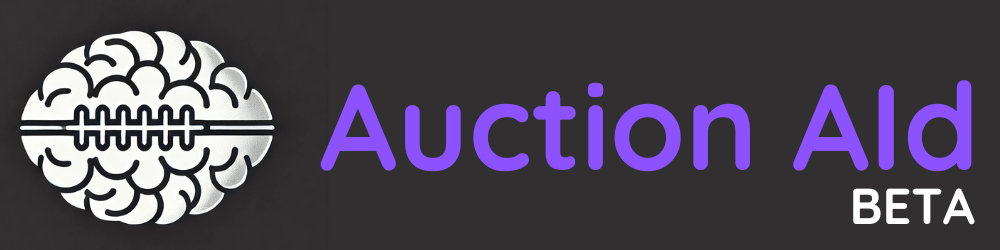
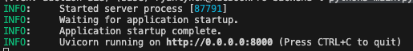

# Auction AId

Welcome to Auction AId!  A Fantasy Football auction draft tool designed to use your league's data to identify where you can find value during your next auction draft.  The tool currently only supports leagues using ESPN for their Fantasy Football league using the API from [cwendt94/espn-api](https://github.com/cwendt94/espn-api).

If you'd like to learn more about how Auction AId works under the hood, read this blog post.

Please free to make suggestions, bug reports or pull requests for features or fixes!  If you enjoyed using Auction AId, buy me a coffee to help me build new free features.

<a href="https://buymeacoffee.com/ryanlynchuf" target="_blank"></a>


## Key Features

- Supports ESPN leagues of any size or scoring format.  Accuracy of results is best for 10, 12, or 14 team leagues using standard, half-ppr, or ppr scoring formats.
- Uses actual league and draft history to predict winning Auction Values of players prior to draft, compared to their true value using Value Over Replacement Player (VORP) calculations
- Provides historical context on auction values for players, which are useful reference, regardless of the projection accuracy

## Prerequisites

Currently, Auction AId is in a basic Beta version.  In the future, it may be host online for easy access, but this version requires running the application on your local computer.  This requires some basic knowledge of Python, React, and running applications through an IDE or terminal.  My personal preference is using the [Visual Studio IDE](https://visualstudio.microsoft.com/), so these instructions are from that perspective.

## Installation

1. Download the current code base from this page and save to your preferred location
2. Open the `auction-aid` repository in the IDE (or navigate to the location in the terminal)

#### Install Backend - Python and Packages

1. Install the latest version of [Python](https://www.python.org/downloads/)
2. Create and activate Python virtual environment 
    - Using Visual Studio: https://code.visualstudio.com/docs/python/environments
    - Using the terminal: https://www.freecodecamp.org/news/how-to-setup-virtual-environments-in-python/
2. Install the required packages from `requirements.txt`

```python
pip install -r /path/to/requirements.txt
```

#### Install Frontend - Node.js, npm, and React

1. Install Node.js and node package manager (npm) using instructions [here](https://gist.github.com/MichaelCurrin/aa1fc56419a355972b96bce23f3bccba)

### Configuration

Auction AId allows for storing data locally or on AWS S3.  If you'd like to save data to S3, the following updates must be made:


#### Create an Configure S3 Bucket and AWS IAM User
1. Create an AWS S3 bucket
2. Create a User in AWS IAM
3. Assign the following S3 IAM Policy to the user.  Update details to your bucket name.

```json
{
    "Version": "2012-10-17",
    "Statement": [
        {
            "Effect": "Allow",
            "Action": [
                "s3:GetObject",
                "s3:PutObject"
            ],
            "Resource": "arn:aws:s3:::your-bucket-name/*"
        },
        {
            "Effect": "Allow",
            "Action": [
                "s3:ListBucket"
            ],
            "Resource": [
                "arn:aws:s3:::your-bucket-name"
            ]
        }
    ]
}
```

4. Create AWS Access Keys for the User


#### Update Auction AId Configuration Files
1. Update the `settings.py` file location in the `backend/config` folder:

``` python
# backend/config/settings.py
CURR_LEAGUE_YR = 2024
S3 = True # Update to True if running on S3
```

2. Create a file titled `.env` in the `auction-aid` folder
3. Populate the `.env` file with your S3 bucket details:

```python
AWS_ACCESS_KEY_ID=your-S3-user-access-key
AWS_SECRET_ACCESS_KEY=your-S3-user-secret-access-key
AWS_S3_BUCKET_NAME_LEAGUE=your-bucket-name
```

### Run Auction AId

1. Open a terminal in the IDE or on the computer.  Navigate to the `frontend` folder of the `auction-aid` repository; if you're currently in the `auction-aid` folder:

```
cd frontend
```

2. Start the frontend web application

```
npm start
```

3. Open an additional terminal in the IDE or on the computer.  Bavigate to the `backend` folder of the `auction-aid` repository; if you're currently in the `auction-aid` folder:

```
cd backend
```

4. Run the backend of the application

```python
python3 main.py
```

A successful result will show a message like the below:



The application is now running!

### Generate Auction AId

1. Login to your league.  If you are in an ESPN Private League, you can find your ESPN_S2 and SWID values manually or using a Google Chrome extension.  See detail [here](https://github.com/cwendt94/espn-api/discussions/150#discussioncomment-133615)
2. Pick your 'League Settings' and 'Auction AId Settings' on the User Interface
3. Click 'Generate Auction Values (AV)'!  Be patient :) if there is a lot of league history this may take some time!

## Troubleshooting / FAQ
This section will be updated as questions become asked frequently!


## Acknowledgements
This project is possible thanks to:

- The great work on the espn-api from [cwendt94/espn-api](https://github.com/cwendt94/espn-api).
- I must give a shoutout to [this post](https://forums.footballguys.com/threads/auction-value-strategy.813174/), which served as the foundation for Auction AId's approach for True Auction Value (TAV).  Where ever you are, azmat, thank you for the inspiration!